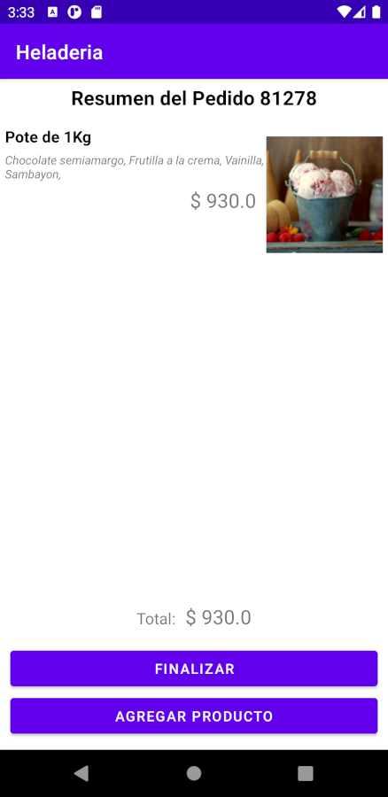

# Heladeria

Aplicación Android (Kotlin) que permite realizar compla de helados seleccionando el tipo dn embase, los gustos y el medio de pago (mock). La pantalla final muestra el numero de pedido y un acceso a estadisticas de ventas segmentada por cada medio de pago (lectura en SQLite).

## Pantallas

1) Selección de helado (solo uno)

2) Selección de sabores, la cantidad dependerá del tipo de helado

3) Resumen de pedido, aquí se verán todos los items y el importe total

4) Medio de pago, solo se puede elegir uno y se mostrará un error si llegó al limite de cobros

5) Pantalla de confirmacion de compra, entregará numero de pedido

6) Estadisticas, aquí se podrán ver las cajas y el volumen de cobros

